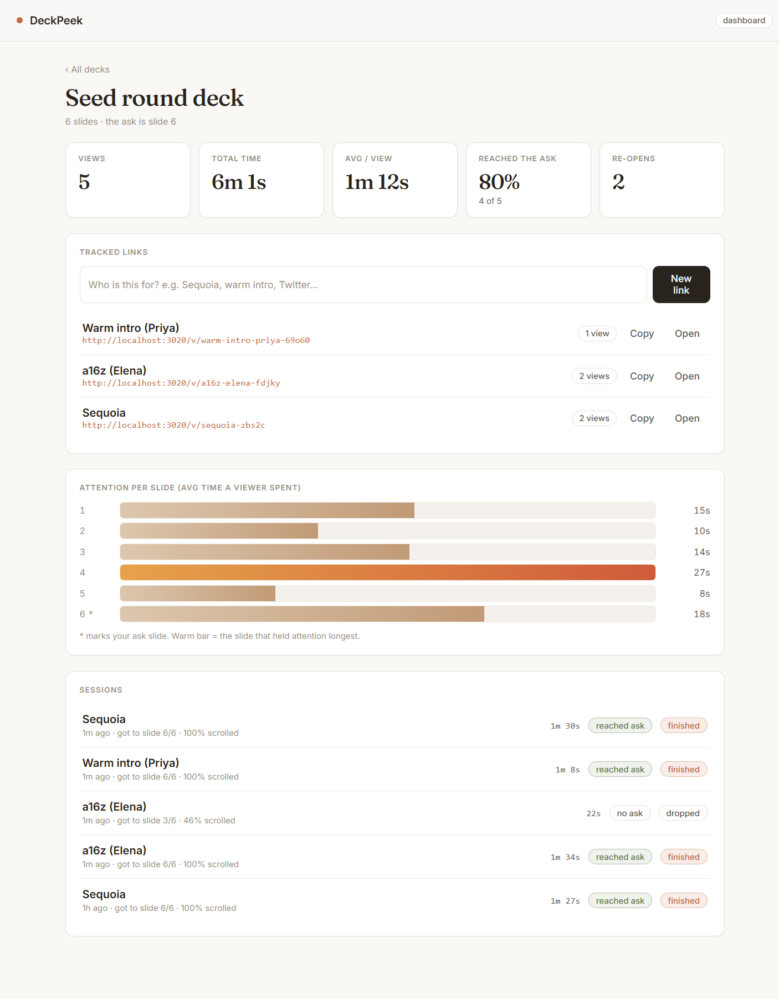

# DeckPeek

See how people actually read your pitch deck. Upload a PDF, share a link, and
get the numbers that matter: time on each slide, how far they scrolled, whether
they reached your ask, and if they came back.

Self-hosted, no accounts, no data leaves your machine. MIT.



## Why

We're raising, and sending a deck out felt like dropping it into a hole. You
email a PDF and hear nothing back: no idea if anyone opened it, which slide lost
them, or whether they ever reached the ask. The tools that tell you this are
closed and pricey, and I'd rather not push our real deck through someone else's
service. So I built a small one we could host ourselves and read the signal off
our own decks.

The other half of it: we had a couple of friends who work in VC read the deck
through here, so we could see which slides actually held their attention and
which got skipped, instead of the polite version they'd give us over coffee. That
gut-check was useful enough that we cleaned it up and put it out.

## Run it

```bash
npm install
npm run dev
```

Open http://localhost:3000, drop in a PDF, make a link, and open it in another
tab. Scroll through, then reload the deck page to see the numbers.

## How it works

You can't track a raw PDF, so DeckPeek renders it in its own viewer behind a
link. You send the link, not the file. The viewer records time per slide, scroll
depth and the furthest slide reached, and writes it to a local SQLite file. The
deck page reads that back as an attention heatmap plus a per-session list.

Next.js + libsql (SQLite) + pdf.js. Uploads land in `data/uploads`, the db is
`data/deckpeek.db`.

## Config

- `DECKPEEK_DB_URL`: libsql url, defaults to `file:data/deckpeek.db` (point it at
  Turso to go remote)
- `DECKPEEK_UPLOAD_DIR`: where PDFs are stored, defaults to `data/uploads`

## Heads up

It's an MVP. There's no real auth yet (an owner is just a cookie), so add that,
plus rate limiting and shared storage, before you rely on it. PRs welcome.
